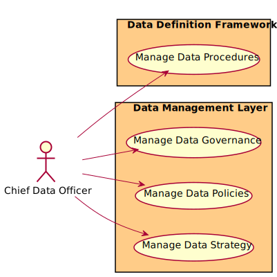

# Chief Data Officer

Responsible for setting strategy and governance of data in the organization.

There are several users of the system. We first took a use case analysis approach to the architecture. First,
identifying the actors/users of the system and building out how the actor uses the system? What their key objectives and
goals are? and How they use the system? This list is not an exhaustive list of all actors of the system but are the
primary actors.

These actors are found in most organizations and there are several different organizational structures that can be
employed. The key is to identify the people or organization that fits the different actors in the systems. The following
is an example of a centralized organizational structure of the actors of the system.

## Use Cases

* [Manage Data Procedures](usecase-ManageDataProcedures)
* [Manage Data Governance](usecase-ManageDataGovernance)
* [Manage Data Policies](usecase-ManageDataPolicies)
* [Manage Data Strategy](usecase-ManageDataStrategy)

  

## User Interface
TBD

## Command Line Interface
* [ edgemere diml ddf dataprocedure/list](action--edgemere-diml-ddf-dataprocedure-list) - Manage Data Procedures is the description
* [ edgemere diml dml data/govern](action--edgemere-diml-dml-data-govern) - Manage Data Governance is the description
* [ edgemere diml dml datapolicy/list](action--edgemere-diml-dml-datapolicy-list) - Manage Data Policies is the description
* [ edgemere diml dml datastrategy/list](action--edgemere-diml-dml-datastrategy-list) - Manage Data Strategy is the description

