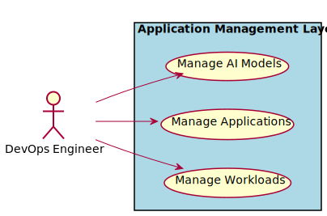

# DevOps Engineer

Responsible for the management of the automation of the delivery of applications and solutions in the organization.

There are several users of the system. We first took a use case analysis approach to the architecture. First,
identifying the actors/users of the system and building out how the actor uses the system? What their key objectives and
goals are? and How they use the system? This list is not an exhaustive list of all actors of the system but are the
primary actors.

These actors are found in most organizations and there are several different organizational structures that can be
employed. The key is to identify the people or organization that fits the different actors in the systems. The following
is an example of a centralized organizational structure of the actors of the system.

## Use Cases

* [Manage AI Models](usecase-ManageAIModels)
* [Manage Applications](usecase-ManageApplications)
* [Manage Workloads](usecase-ManageWorkloads)

  

## User Interface
TBD

## Command Line Interface
* [ edgemere aml aimodel/list](action--edgemere-aml-aimodel-list) - Data Scientist manages AI models and ties them to and application and data set. DevOps will make sure when applications and AI models are updated that they are updatedtogether.
* [ edgemere aml application/list](action--edgemere-aml-application-list) - DevOps Engineers and Application Developers need the ability to manage applications across multiple environments, clouds, and types of infrastructure.
* [ edgemere aml workload/list](action--edgemere-aml-workload-list) - Application Developers need the ability to connect applications together through Workflows. This gives the organization the automate complex data interactions between legacy and modern applications across a hybrid infrastructure (Multi-Hybrid Cloud).

