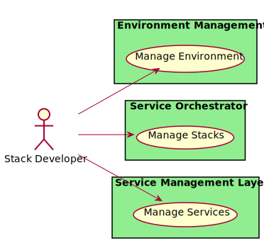

# Stack Developer

Responsible for developing reusable micro-services and application stacks in the organization.

There are several users of the system. We first took a use case analysis approach to the architecture. First,
identifying the actors/users of the system and building out how the actor uses the system? What their key objectives and
goals are? and How they use the system? This list is not an exhaustive list of all actors of the system but are the
primary actors.

These actors are found in most organizations and there are several different organizational structures that can be
employed. The key is to identify the people or organization that fits the different actors in the systems. The following
is an example of a centralized organizational structure of the actors of the system.

## Use Cases

* [Manage Environment](usecase-ManageEnvironment)
* [Manage Stacks](usecase-ManageStacks)
* [Manage Services](usecase-ManageServices)

  

## User Interface
TBD

## Command Line Interface
* [ edgemere sml em environment/list](action--edgemere-sml-em-environment-list) - Manage Environment allows the actors (IT Operations and Stack Developer) to create environments, and establish policies for services running in the environment.
* [ edgemere sml so stack/list](action--edgemere-sml-so-stack-list) - Manage Stacks allows the stack developer to create, update, and delete stacks.
* [ edgemere sml service/list](action--edgemere-sml-service-list) - Manage Services is the description

