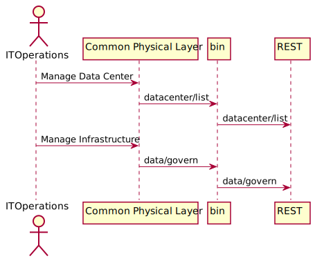
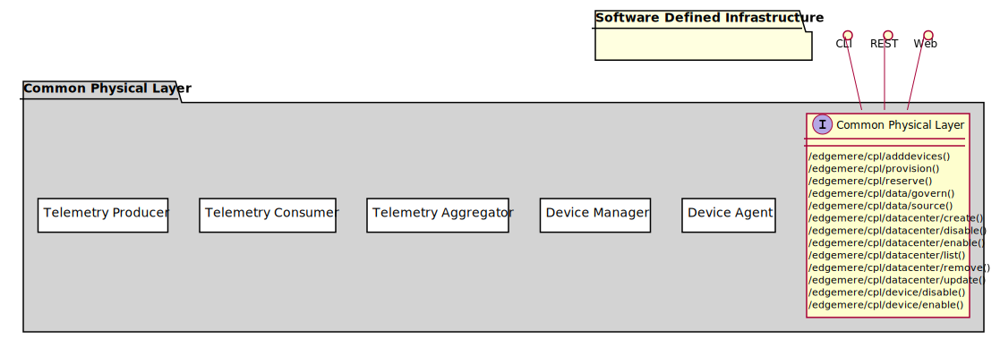

# Common Physical Layer

Common Physical Layer is a package that contains...

The Common Physical Layer (CPL) contains abstractions that allow for beeter management across an ecosystem inside the
data center, in the cloud, and on the edge devices. These abstractions give the ability to manage a highly variable
hardware configurations by describing the common operating and taxonomy of the devices. This architectural layer has the
goal of addressing the following characteristics:

* Common Taxonomy
* Portability and Interopoerability
* Security and Root of Trust
* Common Management Control Plane
* Performance Optimization
* Stability and Reliability
* Flexibility and Agility

The CPL sits at the bottom of the Architectural stack and is the foundation for all of the other layers of the
architecture. It does rely on the [Security](package--edgemere-sa) and [Identify](package--edgemere-ia) sspects to
establish hardware root of trust, identity and encryption of data at the lowest levels.

The CPL establishes a taxonomy of hardware devices that are generalized. This makes it easier to create common services
and operating models for the devices. This includes devices in Public Clouds, Private Clouds, Legacy Infrastructure, and
Edge Devices. All of these devices have common [hardware](class-hardware):
[compute](class-computehardware), [storage](class-storagehardware),
[network](class-networkhardware), and [accellerators](class-acceleratorshardware). Understanding that
each [device](class-device) can have a unique set of capabilities that are delivered from the unique hardware of the
device is key to establishing a common management control plane.

The key element in this layer is the [Device](class-device). It is represented by a model that contains
several [hardware](class-hardware) elements. The [device](class-device) has a profile that shows the capabilities of
the [device](class-device) and its [hardware](class-hardware) as well as a current capacity of
the [device](class-device). The [device](class-device) is has a simple interface for control and telemetry up to
the [software defined infrastructure layer - SDI](package--edgemere-sdi) so [applications](class-application)
and [services](class-service) can be deployed to the [device](class-device) and its (hardware)[class-hardware].

With the explosion of the number IoT devices, the complexity of managing the devices inconjunction with devices in the
cloud and the datacenter. Managing the large number of devices can become overwhelming for
[IT operations engineer](actor-itops) as well as any automated IT management system. For this reason the architect has
created an element called the [Aggregated Device](class-aggregateddevice). That allows for the grouping of devices into
collections so they can be managed and controlled as a group instead of as of individual
devices. [Aggregated devices](class-aggregateddevice) can contain [devices](class-device) or
other [aggregated devices](class-aggregatedevice)
which gives the ability to have an infinite number of layers in the hierarchy of devices.

In this example a topology of devices have been established to give the [IT operations engineer](actor-itops)
the ability to manage all of the devices connected to a data center. In "Data Center 1"
there are 4 Edge Devices, Data Center 2 has 4 Edge Devices and Data Center 3 has an Aggregated Edge Device and a normal
Device. Aggregation of devices can happen along geographic, device capabilities, security profiles, etc... The key is
that the topology is established to help with the physical management of the devices.

Many times organizations combine the physical management and the logical management of devices. Basically combining the
Cloud topology and the Control Topology together. This architecture separates the two topologies giving the flexibility
to establish clouds that span multip physical domains. Including establishing a cloud that spans resources in data
centers, public clouds and edge devices. Giving the ability to schedule and manage applications and services across
traditional boundaries.

In this example you can see three clouds that share devices and span the control topology that was established for
optmized IT operations. This flexibility allows for clouds (logical devices) to adapt to changing environments. Theses
changes can include everything from cyber threats, physical disasters, partial connectivity of edge devices, or even
someone tripping over a network connection in the data center.

## Use Cases

The following are the use cases of the Common Physical Layer subsystem. Each use case has primary and secondary scenarios
that are elaborated in the use case descriptions.

* [Manage Data Center](usecase-ManageDataCenter)
* [Manage Infrastructure](usecase-ManageInfrastructure)

## Users

The following are the actors of the Common Physical Layer subsystem. This can include people, other subsystems 
inside the solution and even external subsystems. 

* [ITOperations](actor-itops)

## Interface

The subsystem has a REST, CLI, WebSocket, and Web interface. Use Cases and Scenarios can use any or all
of the interfaces to perform the work that needs to be completed. The following  diagram shows how
users interact with the system.

* [ edgemere cpl adddevices](#action--edgemere-cpl-adddevices)
* [ edgemere cpl provision](#action--edgemere-cpl-provision)
* [ edgemere cpl reserve](#action--edgemere-cpl-reserve)
* [ edgemere cpl data govern](#action--edgemere-cpl-data-govern)
* [ edgemere cpl data source](#action--edgemere-cpl-data-source)
* [ edgemere cpl datacenter create](#action--edgemere-cpl-datacenter-create)
* [ edgemere cpl datacenter disable](#action--edgemere-cpl-datacenter-disable)
* [ edgemere cpl datacenter enable](#action--edgemere-cpl-datacenter-enable)
* [ edgemere cpl datacenter list](#action--edgemere-cpl-datacenter-list)
* [ edgemere cpl datacenter remove](#action--edgemere-cpl-datacenter-remove)
* [ edgemere cpl datacenter update](#action--edgemere-cpl-datacenter-update)
* [ edgemere cpl device disable](#action--edgemere-cpl-device-disable)
* [ edgemere cpl device enable](#action--edgemere-cpl-device-enable)

## Logical Artifacts

The Data Model for the  Common Physical Layer subsystem shows how the different objects and classes of object interact
and their structure.

### Sub Packages

The Common Physical Layer subsystem has sub packages as well. These subsystems are logical components to better
organize the architecture and make it easier to analyze, understand, design, and implement.

* [Device Agent](package--edgemere-cpl-da)
* [Device Manager](package--edgemere-cpl-dm)
* [Telemetry Aggregator](package--edgemere-cpl-ta)
* [Telemetry Consumer](package--edgemere-cpl-tc)
* [Telemetry Producer](package--edgemere-cpl-tp)

### Classes

The following are the classes in the data model of the Common Physical Layer subsystem.

* [Device](class-Device)
* [AggregatedDevice](class-AggregatedDevice)
* [Metric](class-Metric)
* [MetricAttribute](class-MetricAttribute)
* [MetricComposite](class-MetricComposite)
* [MetricConsumeable](class-MetricConsumeable)
* [PhysicalProfile](class-PhysicalProfile)
* [Hardware](class-Hardware)
* [ComputeHardware](class-ComputeHardware)
* [NetworkHardware](class-NetworkHardware)
* [StorageHardware](class-StorageHardware)
* [AcceleratorHardware](class-AcceleratorHardware)

## Deployment Architecture

This subsystem is deployed using micro-services as shown in the diagram below. The 'micro' module is
used to implement the micro-services in the system. The subsystem also has an CLI, REST and Web Interface
exposed through a nodejs application. The nodejs application will interface with the micro-services and
can monitor and drive work-flows through the mesh of micro-services. The deployment of the subsystem is 
dependent on the environment it is deployed. This subsystem has the following environments:
* [dev](environment--edgemere-cpl-dev)
* [test](environment--edgemere-cpl-test)
* [prod](environment--edgemere-cpl-prod)

## Physical Architecture

The Common Physical Layer subsystem is physically laid out on a hybrid cloud infrastructure. Each microservice belongs
to a secure micro-segmented network. All of the micro-services communicate to each other and the main app through a
REST interface. A Command Line Interface (CLI), REST or Web User interface for the app is how other subsystems or actors 
interact. Requests are forwarded to micro-services through the REST interface of each micro-service. The subsystem has
the a unique layout based on the environment the physical space. The following are the environments for this
subsystems.
* [dev](environment--edgemere-cpl-dev)
* [test](environment--edgemere-cpl-test)
* [prod](environment--edgemere-cpl-prod)

## Micro-Services

These are the micro-services for the subsystem. The combination of the micro-services help implement
the subsystem's logic.

### dev

Detail information for the [dev environment](environment--edgemere-cpl-dev)
can be found [here](environment--edgemere-cpl-dev)

Services in the dev environment

* web : cpl_web:latest
* deviceagent : cpl_da:latest
* devicemanager : cpl_dm:latest
* telemetry : cpl_tc:latest

### test

Detail information for the [test environment](environment--edgemere-cpl-test)
can be found [here](environment--edgemere-cpl-test)

Services in the test environment

* web : cpl_web:latest
* deviceagent : cpl_da:latest
* devicemanager : cpl_dm:latest
* telemetry : cpl_tc:latest

### prod

Detail information for the [prod environment](environment--edgemere-cpl-prod)
can be found [here](environment--edgemere-cpl-prod)

Services in the prod environment

* web : cpl_web:latest
* deviceagent : cpl_da:latest
* devicemanager : cpl_dm:latest
* telemetry : cpl_tc:latest

## Activities and Flows
The Common Physical Layer subsystem provides the following activities and flows that help satisfy the use
cases and scenarios of the subsystem.

### Messages Sent

TBD

## Interface Details
The Common Physical Layer subsystem has a well defined interface. This interface can be accessed using a
command line interface (CLI), REST interface, and Web user interface. This interface is how all other
subsystems and actors can access the system.

### Action  edgemere cpl adddevices

* REST - /edgemere/cpl/adddevices
* bin -  edgemere cpl adddevices
* js - .edgemere.cpl.adddevices

Add Devices to the Data Center

| Name | Type | Required | Description |
|---|---|---|---|
| item | object |true | Devices to add to the Data Center |

### Action  edgemere cpl provision

* REST - /edgemere/cpl/provision
* bin -  edgemere cpl provision
* js - .edgemere.cpl.provision

Provision the resources on the devices

| Name | Type | Required | Description |
|---|---|---|---|
| resource | object |true | Resource to provision |

### Action  edgemere cpl reserve

* REST - /edgemere/cpl/reserve
* bin -  edgemere cpl reserve
* js - .edgemere.cpl.reserve

Get Reservations from Devices, Aggregate Deivces, and DataCenters

| Name | Type | Required | Description |
|---|---|---|---|
| request | object |true | Request for the reservation |

### Action  edgemere cpl data govern

* REST - /edgemere/cpl/data/govern
* bin -  edgemere cpl data govern
* js - .edgemere.cpl.data.govern

Description of the action

| Name | Type | Required | Description |
|---|---|---|---|
| attr1 | string |false | Description for the parameter |

### Action  edgemere cpl data source

* REST - /edgemere/cpl/data/source
* bin -  edgemere cpl data source
* js - .edgemere.cpl.data.source

Description of the action

| Name | Type | Required | Description |
|---|---|---|---|
| attr1 | string |false | Description for the parameter |

### Action  edgemere cpl datacenter create

* REST - /edgemere/cpl/datacenter/create
* bin -  edgemere cpl datacenter create
* js - .edgemere.cpl.datacenter.create

Description of the action

| Name | Type | Required | Description |
|---|---|---|---|
| attr1 | string |false | Description for the parameter |

### Action  edgemere cpl datacenter disable

* REST - /edgemere/cpl/datacenter/disable
* bin -  edgemere cpl datacenter disable
* js - .edgemere.cpl.datacenter.disable

Description of the action

| Name | Type | Required | Description |
|---|---|---|---|
| attr1 | string |false | Description for the parameter |

### Action  edgemere cpl datacenter enable

* REST - /edgemere/cpl/datacenter/enable
* bin -  edgemere cpl datacenter enable
* js - .edgemere.cpl.datacenter.enable

Description of the action

| Name | Type | Required | Description |
|---|---|---|---|
| attr1 | string |false | Description for the parameter |

### Action  edgemere cpl datacenter list

* REST - /edgemere/cpl/datacenter/list
* bin -  edgemere cpl datacenter list
* js - .edgemere.cpl.datacenter.list

Description of the action

| Name | Type | Required | Description |
|---|---|---|---|
| attr1 | string |false | Description for the parameter |

### Action  edgemere cpl datacenter remove

* REST - /edgemere/cpl/datacenter/remove
* bin -  edgemere cpl datacenter remove
* js - .edgemere.cpl.datacenter.remove

Description of the action

| Name | Type | Required | Description |
|---|---|---|---|
| attr1 | string |false | Description for the parameter |

### Action  edgemere cpl datacenter update

* REST - /edgemere/cpl/datacenter/update
* bin -  edgemere cpl datacenter update
* js - .edgemere.cpl.datacenter.update

Description of the action

| Name | Type | Required | Description |
|---|---|---|---|
| attr1 | string |false | Description for the parameter |

### Action  edgemere cpl device disable

* REST - /edgemere/cpl/device/disable
* bin -  edgemere cpl device disable
* js - .edgemere.cpl.device.disable

Disable Device and all of its hardware

| Name | Type | Required | Description |
|---|---|---|---|
| name | string |false | Name of the device |
| id | string |false | ID of the device |

### Action  edgemere cpl device enable

* REST - /edgemere/cpl/device/enable
* bin -  edgemere cpl device enable
* js - .edgemere.cpl.device.enable

Enable Device and all of its hardware

| Name | Type | Required | Description |
|---|---|---|---|
| name | string |false | Name of the device |
| id | string |false | ID of the device |

