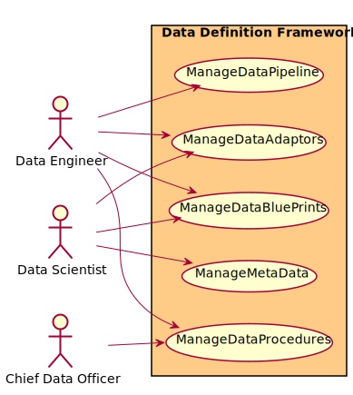
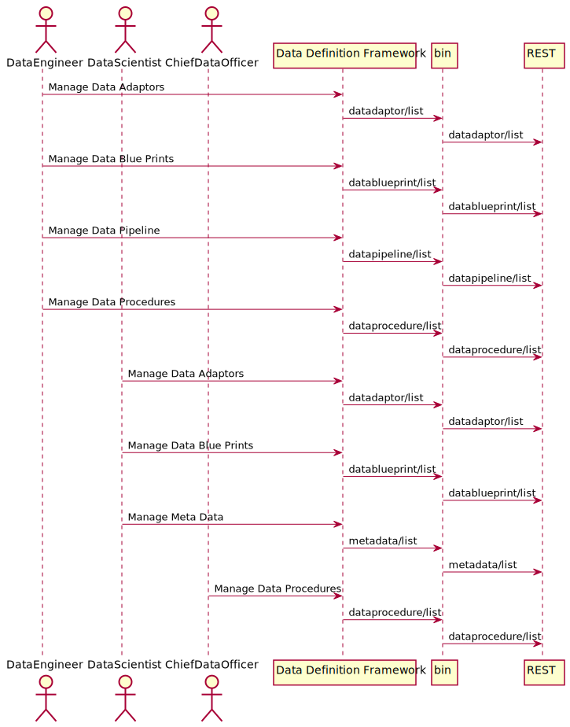
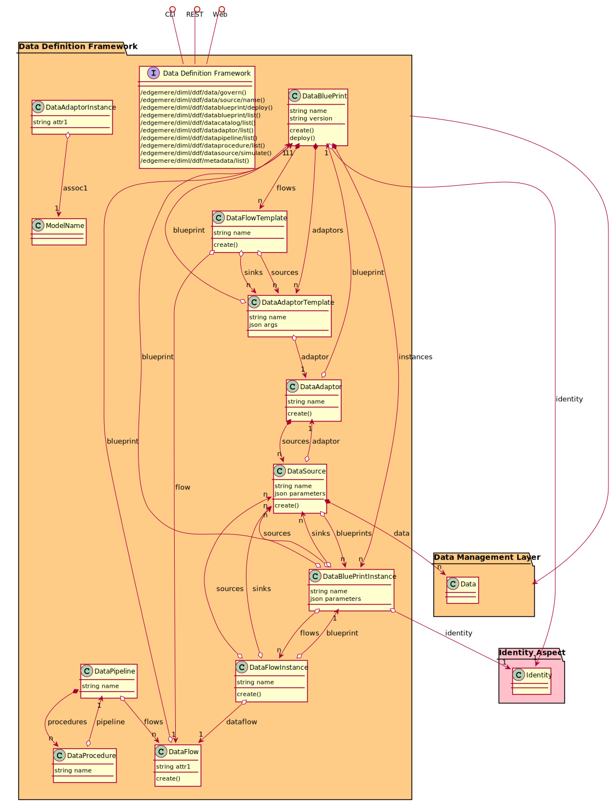

# Data Definition Framework

Data Definition Framework is a package that contains...

## Use Cases

* [Manage Data Adaptors](usecase-ManageDataAdaptors)
* [Manage Data Blue Prints](usecase-ManageDataBluePrints)
* [Manage Data Pipeline](usecase-ManageDataPipeline)
* [Manage Data Procedures](usecase-ManageDataProcedures)
* [Manage Meta Data](usecase-ManageMetaData)

## Users
* [DataEngineer](actor-dataengineer)
* [DataScientist](actor-datascientist)
* [ChiefDataOfficer](actor-cdo)

## Interface
The subsystem has a REST, CLI, WebSocket, and Web interface. Use Cases and Scenarios can use any or all
of the interfaces to perform the work that needs to be completed. The following  diagram shows how
users interact with the system.

* [ edgemere diml ddf data govern](#action--edgemere-diml-ddf-data-govern)
* [ edgemere diml ddf data source name](#action--edgemere-diml-ddf-data-source-name)
* [ edgemere diml ddf datablueprint deploy](#action--edgemere-diml-ddf-datablueprint-deploy)
* [ edgemere diml ddf datablueprint list](#action--edgemere-diml-ddf-datablueprint-list)
* [ edgemere diml ddf datacatalog list](#action--edgemere-diml-ddf-datacatalog-list)
* [ edgemere diml ddf datadaptor list](#action--edgemere-diml-ddf-datadaptor-list)
* [ edgemere diml ddf datapipeline list](#action--edgemere-diml-ddf-datapipeline-list)
* [ edgemere diml ddf dataprocedure list](#action--edgemere-diml-ddf-dataprocedure-list)
* [ edgemere diml ddf datasource simulate](#action--edgemere-diml-ddf-datasource-simulate)
* [ edgemere diml ddf metadata list](#action--edgemere-diml-ddf-metadata-list)

## Logical Artifacts
The Data Model for the  Data Definition Framework shows how the different objects and classes of object interact
and their structure.

### Sub Packages

* [Blue Print Management](package--edgemere-diml-ddf-bpm)
* [Data Adaptor Framework](package--edgemere-diml-ddf-daf)
* [Data Flow](package--edgemere-diml-ddf-df)
* [Data Repository](package--edgemere-diml-ddf-dr)

### Classes

* [DataAdaptor](class-DataAdaptor)
* [DataAdaptorInstance](class-DataAdaptorInstance)
* [DataAdaptorTemplate](class-DataAdaptorTemplate)
* [DataBluePrint](class-DataBluePrint)
* [DataBluePrintInstance](class-DataBluePrintInstance)
* [DataFlow](class-DataFlow)
* [DataFlowInstance](class-DataFlowInstance)
* [DataFlowTemplate](class-DataFlowTemplate)
* [DataPipeline](class-DataPipeline)
* [DataProcedure](class-DataProcedure)
* [DataSource](class-DataSource)

## Activities and Flows
The Data Definition Framework subsystem provides the following activities and flows.

### Messages Handled
| Message | Action | Description |
|---|---|---|

|    |    |    |

### Messages Sent

TBD

## Deployment Architecture

This subsystem is deployed using micro-services as shown in the diagram below. The 'micro' module is
used to implement the micro-services in the system.
The subsystem also has an CLI, REST and Web Interface exposed through a sailajs application. The sailsjs
application will interface with the micro-services and can monitor and drive work-flows through the mesh of
micro-services.

## Physical Architecture

The Data Definition Framework subsystem is is physically laid out on a hybrid cloud infrastructure. Each microservice is shown
how they connect to each other. All of the micro-services communicate to each other and the main app through a
REST interface. A CLI, REST or Web interface for the app is how other subsystems or actors interact. Requests are
forwarded to micro-services through the REST interface of each micro-service.

## Micro-Services
These are the micro-services for the subsystem. The combination of the micro-services help implement
the subsystem's logic.

### dev
Detail information for the [dev environment](environment--edgemere-diml-ddf-dev)
can be found [here](environment--edgemere-diml-ddf-dev)

Services in the dev environment

* frontend : diml_ddf_web
* gw : diml_ddf_gw

### test
Detail information for the [test environment](environment--edgemere-diml-ddf-test)
can be found [here](environment--edgemere-diml-ddf-test)

Services in the test environment

* frontend : diml_ddf_web
* gw : diml_ddf_gw

### prod
Detail information for the [prod environment](environment--edgemere-diml-ddf-prod)
can be found [here](environment--edgemere-diml-ddf-prod)

Services in the prod environment

* frontend : diml_ddf_web
* gw : diml_ddf_gw

## Interface Details

### Action  edgemere diml ddf data govern

* REST - /edgemere/diml/ddf/data/govern
* bin -  edgemere diml ddf data govern
* js - .edgemere.diml.ddf.data.govern

Description of the action

| Name | Type | Required | Description |
|---|---|---|---|
| attr1 | string |false | Description for the parameter |

### Action  edgemere diml ddf data source name

* REST - /edgemere/diml/ddf/data/source/name
* bin -  edgemere diml ddf data source name
* js - .edgemere.diml.ddf.data.source.name

Description of the action

| Name | Type | Required | Description |
|---|---|---|---|
| attr1 | string |false | Description for the parameter |

### Action  edgemere diml ddf datablueprint deploy

* REST - /edgemere/diml/ddf/datablueprint/deploy
* bin -  edgemere diml ddf datablueprint deploy
* js - .edgemere.diml.ddf.datablueprint.deploy

Description of the action

| Name | Type | Required | Description |
|---|---|---|---|
| name | string |true | Name instance of the blueprint |
| blueprint | string |true | Name of the blueprint |
| file | YAML |false | File of with the parameters for the deployment |
| sources | string |false | Names and values of the sources for the blueprint |

### Action  edgemere diml ddf datablueprint list

* REST - /edgemere/diml/ddf/datablueprint/list
* bin -  edgemere diml ddf datablueprint list
* js - .edgemere.diml.ddf.datablueprint.list

Description of the action

| Name | Type | Required | Description |
|---|---|---|---|
| attr1 | string |false | Description for the parameter |

### Action  edgemere diml ddf datacatalog list

* REST - /edgemere/diml/ddf/datacatalog/list
* bin -  edgemere diml ddf datacatalog list
* js - .edgemere.diml.ddf.datacatalog.list

Description of the action

| Name | Type | Required | Description |
|---|---|---|---|
| attr1 | string |false | Description for the parameter |

### Action  edgemere diml ddf datadaptor list

* REST - /edgemere/diml/ddf/datadaptor/list
* bin -  edgemere diml ddf datadaptor list
* js - .edgemere.diml.ddf.datadaptor.list

Description of the action

| Name | Type | Required | Description |
|---|---|---|---|
| attr1 | string |false | Description for the parameter |

### Action  edgemere diml ddf datapipeline list

* REST - /edgemere/diml/ddf/datapipeline/list
* bin -  edgemere diml ddf datapipeline list
* js - .edgemere.diml.ddf.datapipeline.list

Description of the action

| Name | Type | Required | Description |
|---|---|---|---|
| attr1 | string |false | Description for the parameter |

### Action  edgemere diml ddf dataprocedure list

* REST - /edgemere/diml/ddf/dataprocedure/list
* bin -  edgemere diml ddf dataprocedure list
* js - .edgemere.diml.ddf.dataprocedure.list

Description of the action

| Name | Type | Required | Description |
|---|---|---|---|
| attr1 | string |false | Description for the parameter |

### Action  edgemere diml ddf datasource simulate

* REST - /edgemere/diml/ddf/datasource/simulate
* bin -  edgemere diml ddf datasource simulate
* js - .edgemere.diml.ddf.datasource.simulate

Simulate data in the data source

| Name | Type | Required | Description |
|---|---|---|---|
| name | string |true | Name of the DataSource to simulate |
| file | YAML |true | file that contains the data to simulate |

### Action  edgemere diml ddf metadata list

* REST - /edgemere/diml/ddf/metadata/list
* bin -  edgemere diml ddf metadata list
* js - .edgemere.diml.ddf.metadata.list

Description of the action

| Name | Type | Required | Description |
|---|---|---|---|
| attr1 | string |false | Description for the parameter |

